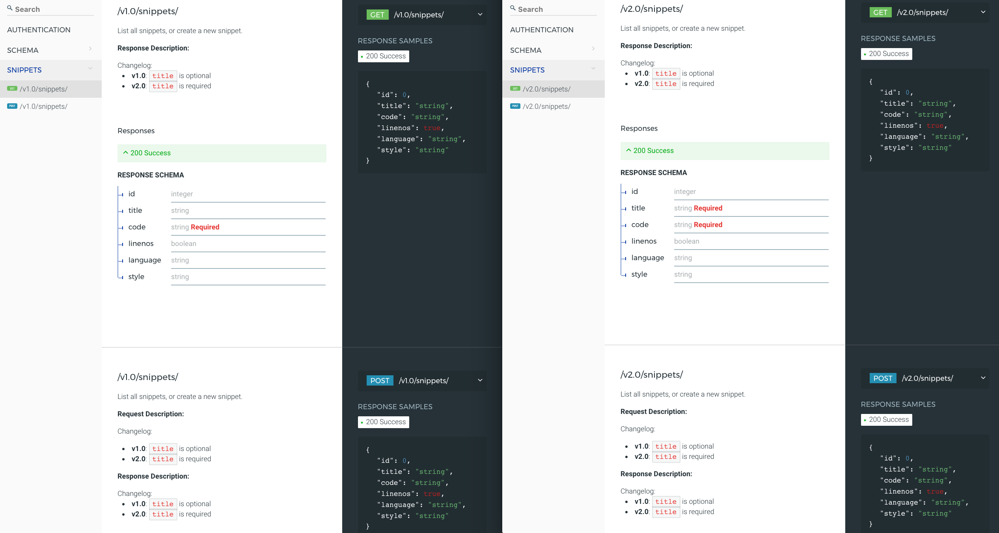

===========
DRF OpenAPI
===========

.. image:: https://img.shields.io/pypi/v/drf_openapi.svg
        :target: https://pypi.python.org/pypi/drf_openapi

.. image:: https://img.shields.io/travis/limdauto/drf_openapi.svg
        :target: https://travis-ci.org/limdauto/drf_openapi

.. image:: https://readthedocs.org/projects/drf-openapi/badge/?version=latest
        :target: https://drf-openapi.readthedocs.io/en/latest/?badge=latest
        :alt: Documentation Status

.. image:: https://pyup.io/repos/github/limdauto/drf_openapi/shield.svg
     :target: https://pyup.io/repos/github/limdauto/drf_openapi/
     :alt: Updates

Generates OpenAPI-compatible schema from API made with Django Rest Framework. Use `ReDoc <https://github.com/Rebilly/ReDoc>`_ as default interface instead of Swagger.
First-class support for API versioning changelog & method-specific schema definition.

* Free software: MIT license
* Documentation: https://drf-openapi.readthedocs.io.

.. contents:: 

Background
-----------

Django Rest Framework has an `API schema generation/declaration mechanism <http://www.django-rest-framework.org/api-guide/schemas/>`_ provided by
`coreapi <http://www.coreapi.org/>`_ standard. There are a couple of problems with the current ecosystem:

- CoreAPI is not compatible out of the box with `OpenAPI <https://www.openapis.org/>`_ which is a much more popular API standard with superior tooling support, i.e. Swagger et. al.
- The OpenAPI codec (compatibility layer) that CoreAPI team provides drops / doesn't support a number of useful OpenAPI features.
- There is no support for versioning or method-specific schema.

This project was born to bridge the gap. The high-level requirements are as followed:

- Can be dropped into any existing DRF project without any code change necessary.
- Provide clear disctinction between request schema and response schema.
- Provide a versioning mechanism for each schema. Support defining schema by version range syntax, e.g. :code:`>1.0, <=2.0`
- All this information should be bound to view methods, not view classes.

It's important to stress the non-intrusiveness requirement, not least because I want to minimize what I will have to change when
DRF itself decides to support OpenAPI officially, if at all.

Design
-------------

- Schema are automatically generated from `serializers <http://www.django-rest-framework.org/api-guide/serializers/>`_
    - From here onwards, :code:`schema` and :code:`serializer` are used interchangably
- Versioned schema is supported by extending :code:`VersionedSerializers`.
- Metadata, i.e. versioning, response and request schema, are bound to a view method through the :code:`view_config` decorator.
- Automatic response validation is optionally provided :code:`view_config(response_serializer=FooSerializer, validate_response=True)`

Constraints
-------------

Currently DRF OpenAPI only supports DRF project that has `versioning <http://www.django-rest-framework.org/api-guide/versioning/#urlpathversioning>`_ enabled.
I have only tested `URLPathVersioning <http://www.django-rest-framework.org/api-guide/versioning/#urlpathversioning>`_ but I intend to suppor the full range of
versioning scheme supported by DRF.

Also the schema view is limited to staff member for now. I plan to add more granular permission very soon.

Installation
------------

.. code:: bash
   
   pip install drf_openapi

Usage
----------

1. Quickstart
^^^^^^^^^^^^^^

.. code:: python

   # in settings.py
   INSTALLED_APPS = [
       ...
       'drf_openapi'   
   ]
   REST_FRAMEWORK = {
       'DEFAULT_VERSIONING_CLASS': 'rest_framework.versioning.URLPathVersioning'
   }

   # in urls.py
   urlpatterns += [url(f'{API_PREFIX}/', include('drf_openapi.urls'))]

And voila! Your API documentation will be available at :code:`/<API_PREFIX>/schema`

2. Add schema to a view method
^^^^^^^^^^^^^^^^^^^^^^^^^^^^^^^

DRF OpenAPI support the separation of response schema and request schema on a per view method basis through the use of a `view_config` decorator

.. code:: python

   from drf_openapi.utils import view_config

   class SnippetList(APIView):
   """
   List all snippets, or create a new snippet.
   """
   
   @view_config(response_serializer=SnippetSerializer)
   def get(self, request, version, format=None):
       snippets = Snippet.objects.all()
       res = self.response_serializer(snippets, many=True)
       res.is_valid(raise_exception=True)
       return Response(res.validated_data)

   @view_config(request_serializer=SnippetSerializer, response_serializer=SnippetSerializer)
   def post(self, request, version, format=None):
       req = self.request_serializer(data=request.data)
       req.is_valid(raise_exception=True)
       req.save()
       res = self.response_serializer(req.data)
       res.is_valid(raise_exception=True)
       return Response(res.validated_data, status=status.HTTP_201_CREATED)

3. Add version to schema
^^^^^^^^^^^^^^^^^^^^^^^^^^^^^^^

DRF OpenAPI support schema versioning through versioning the serializers that the schema are generated from.
To make a serializer version-specific, extends :code:`VersionedSerializers`

.. code:: python
   
   from drf_openapi.entities import VersionedSerializers
   from rest_framework import serializers
   

   class SnippetSerializerV1(serializers.Serializer):
       title = serializers.CharField(required=False, allow_blank=True, max_length=100)
   

   class SnippetSerializerV2(SnippetSerializerV1):
       title = serializers.CharField(required=True, max_length=100)
   
   
   class SnippetSerializer(VersionedSerializers):
       """
       Changelog:
   
       * **v1.0**: `title` is optional
       * **v2.0**: `title` is required
       """
   
       VERSION_MAP = (
           ('>=1.0, <2.0', SnippetSerializerV1),
           ('>=2.0', SnippetSerializerV2),
       )

That's it. The :code:`view_config` decorator will be able to correctly determined what serializer to use based on the request version at run time.

Examples
----------

I have recreated the example in `DRF tutorial <http://www.django-rest-framework.org/tutorial/>`_ with OpenAPI schema enabled
in `examples <examples/>`_.
